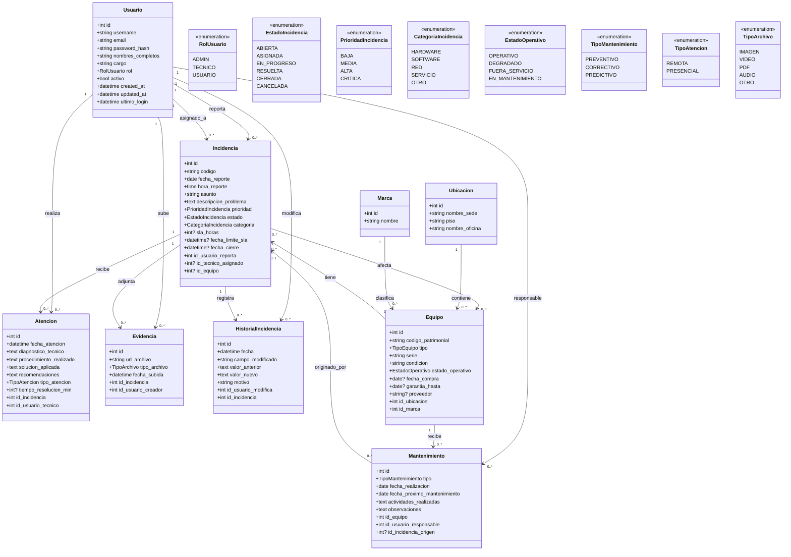

# Diagrama de clases mejorado (Gestión de Incidencias)

Este diseño incorpora mejoras para implementación real con **FastAPI + SQLAlchemy**:

- Cardinalidades corregidas.
- Eliminación de duplicidades (`id_equipo` repetido en `Incidencia`).
- Estados/prioridades como `enum`.
- Auditoría detallada en historial.
- Relación práctica entre incidencias y mantenimientos.

## Diagrama UML (Mermaid)

## Reglas clave sugeridas

1. **Transición de estados controlada**: no permitir `ABIERTA -> CERRADA` sin pasar por `RESUELTA`.
2. **Asignación técnica válida**: solo usuarios con rol `TECNICO` pueden ser `id_tecnico_asignado`.
3. **Auditoría obligatoria**: todo cambio de `estado`, `prioridad` o `id_tecnico_asignado` crea fila en `HistorialIncidencia`.
4. **Trazabilidad documental**: cada `Evidencia` registra autor (`id_usuario_creador`) y fecha.
5. **Mantenimiento correctivo opcionalmente ligado a incidencia** vía `id_incidencia_origen`.

## Índices recomendados

- `incidencia(estado, prioridad, fecha_reporte)`
- `incidencia(id_usuario_reporta)`
- `incidencia(id_tecnico_asignado)`
- `atencion(id_incidencia, fecha_atencion)`
- `mantenimiento(id_equipo, fecha_proximo_mantenimiento)`
- `evidencia(id_incidencia, fecha_subida)`

